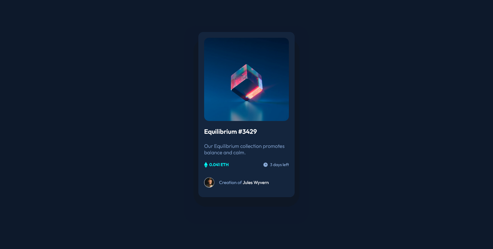

# Frontend Mentor - NFT preview card component solution

This is a solution to the [NFT preview card component challenge on Frontend Mentor](https://www.frontendmentor.io/challenges/nft-preview-card-component-SbdUL_w0U). Frontend Mentor challenges help you improve your coding skills by building realistic projects.

## Table of contents

- [Overview](#overview)
  - [The challenge](#the-challenge)
  - [Screenshot](#screenshot)
  - [Links](#links)
- [My process](#my-process)
  - [Built with](#built-with)
  - [What I learned](#what-i-learned)
  - [Continued development](#continued-development)
- [Author](#author)

## Overview

NFT preview card component

This HTML & CSS only challenge is perfect for anyone just starting out or anyone wanting a small project to play around with.

### The challenge

Users should be able to:

- View the optimal layout depending on their device's screen size
- See hover states for interactive elements

### Screenshot

### Links

- Live Site URL: [Add live site URL here](https://your-live-site-url.com)

## My process

### Built with

- Semantic HTML5 markup
- CSS custom properties
- Flexbox

### What I learned

Learnt more of CSS. A long way to go.

### Continued development

Would like to use more flexible layouts going forward. This was my first frontend-mentor challenge and think I could definitely improve in the fiture.

## Author

- Frontend Mentor - [@Beats-Ayush](https://www.frontendmentor.io/profile/Beats-Ayush)
- Twitter - [@AyushNa75006417](https://twitter.com/AyushNa75006417)
